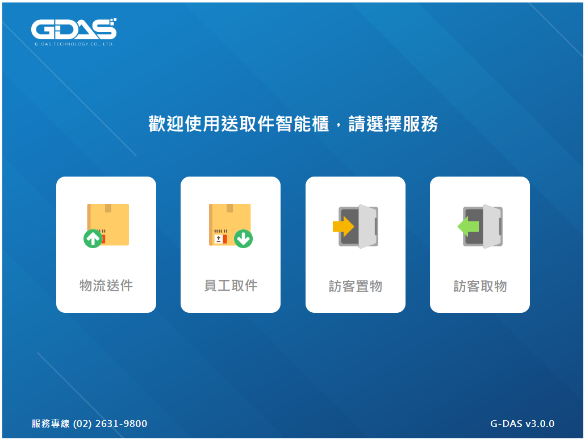
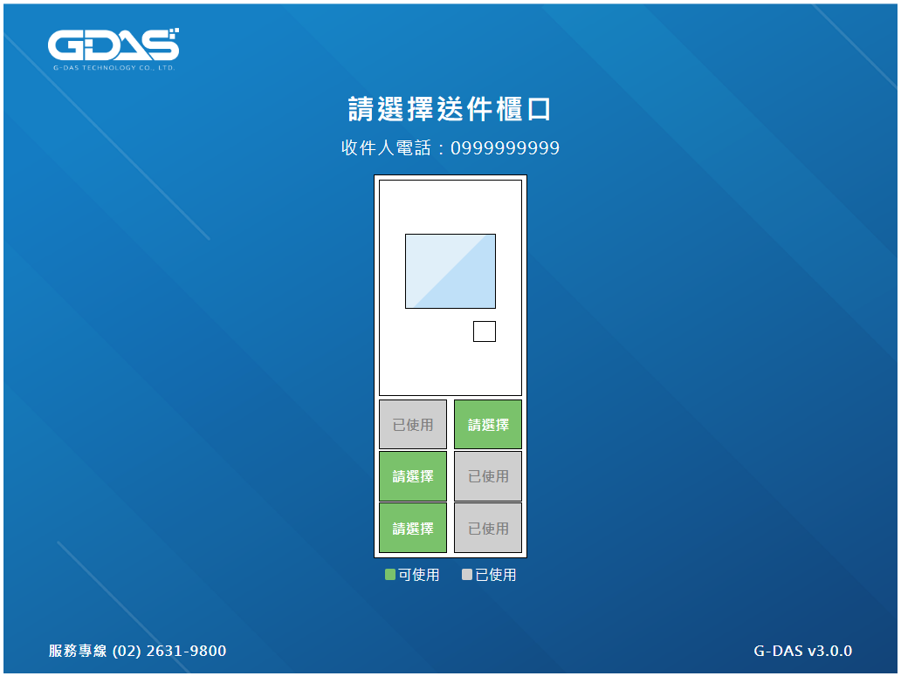

# GDAS interview
Demo page : 
[index](https://joy-chang-2021.github.io/GDASinterview/)
/ [locker](https://joy-chang-2021.github.io/GDASinterview/locker)

點擊首頁任一按鈕，跳轉至 locker 畫面

locker 畫面根據 API 資料顯示可使用的櫃口狀態

---

## Screenshots




---

## Tools

- 伺服器 & 終端機 
  - express 4.18.2
  - nodemon 2.0.20
  - npm-run-all 4.1.5
- 前端套件
  - webpack 5.75.0
  - webpack-cli 5.0.0
  - style-loader 3.3.1
  - css-loader 6.7.2
  - sass-loader 13.2.0
  - sass 1.56.1
  - mini-css-extract-plugin 2.7.0
- Javascript 套件
  - axios 1.2.0
  - jquery 3.6.1
- API
```
http://iotbase-gdaslocker.azurewebsites.net/webapi/system/example/box/status
```

---

## Install

- 由終端機進入目標路徑，使用此指令複製專案
```
git clone https://github.com/Joy-Chang-2021/GDASinterview.git
```
- 進入專案路徑
```
cd GDASinterview
```

- 安裝專案套件
```
npm install
```

- 啟動專案(1)： 此指令同時執行 nodemon 監看伺服器路由及 wabpack 即時打包，修改程式碼後、瀏覽器重新整理即可瀏覽最新的網頁狀態
```
npm run start
```

- 啟動專案(2)： 此指令單純瀏覽最後一次 wabpack 打包後的網頁狀態
```
npm run dev
```

- 本地瀏覽器 http://localhost:3000

- 關閉專案
```
ctrl + C
```
---